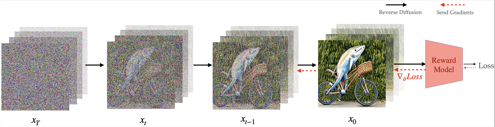

<div align="center">

<!-- TITLE -->
# **Video Diffusion Alignment via Reward Gradient**


[](https://arxiv.org/abs/2407.08737)
[](http://vader-vid.github.io)
</div>

This is the official implementation of our paper [Video Diffusion Alignment via Reward Gradient](https://vader-vid.github.io/) by 

Mihir Prabhudesai*, Russell Mendonca*, Zheyang Qin*, Katerina Fragkiadaki, Deepak Pathak .


<!-- DESCRIPTION -->
## Abstract
We have made significant progress towards building foundational video diffusion models. As these models are trained using large-scale unsupervised data, it has become crucial to adapt these models to specific downstream tasks, such as video-text alignment or ethical video generation. Adapting these models via supervised fine-tuning requires collecting target datasets of videos, which is challenging and tedious. In this work, we instead utilize pre-trained reward models that are learned via preferences on top of powerful discriminative models. These models contain dense gradient information with respect to generated RGB pixels, which is critical to be able to learn efficiently in complex search spaces, such as videos. We show that our approach can enable alignment of video diffusion for aesthetic generations, similarity between text context and video, as well long horizon video generations that are 3X longer than the training sequence length. We show our approach can learn much more efficiently in terms of reward queries and compute than previous gradient-free approaches for video generation.


## Features
- [x] Adaptation of VideoCrafter2 Text-to-Video Model
- [x] Adaptation of Open-Sora V1.2 Text-to-Video Model
- [x] Adaptation of ModelScope Text-to-Video Model
- [ ] Adaptation of Stable Video Diffusion Image2Video Model

## Demo
|         |          |       |
| ----------------------------------------------------------------------------------------------------------------------------------------------------------- | ---------------------------------------------------------------------------------------------------------------------------------------------------------- | ---------------------------------------------------------------------------------------------------------------------------------------------------------- |
|  |  |  |
|  |  |  |
|  |  |  |


## 🌟 VADER-VideoCrafter

We **highly recommend** proceeding with the VADER-VideoCrafter model first, which performs better.

### ⚙️ Installation
Assuming you are in the `VADER/` directory, you are able to create a Conda environments for VADER-VideoCrafter using the following commands:
```bash
cd VADER-VideoCrafter
conda create -n vader_videocrafter python=3.10
conda activate vader_videocrafter
conda install pytorch==2.3.0 torchvision==0.18.0 torchaudio==2.3.0 pytorch-cuda=12.1 -c pytorch -c nvidia
conda install xformers -c xformers
pip install -r requirements.txt
git clone https://github.com/tgxs002/HPSv2.git
cd HPSv2/
pip install -e .
cd ..
```


- We are using the pretrained Text-to-Video [VideoCrafter2](https://huggingface.co/VideoCrafter/VideoCrafter2/blob/main/model.ckpt) model via Hugging Face. If you unfortunately find the model is not automatically downloaded when you running inference or training script, you can manually download it and put the `model.ckpt` in `VADER/VADER-VideoCrafter/checkpoints/base_512_v2/model.ckpt`.

- We provided pretrained LoRA weights on [HuggingFace](https://huggingface.co/zheyangqin/VADER). The `vader_videocrafter_pickscore.pt` is the model fine-tuned using PickScore function on chatgpt_custom_animal.txt with LoRA rank of 16, while `vader_videocrafter_hps_aesthetic.pt` is the model fine-tuned using a combination of HPSv2.1 and Aesthetic function on chatgpt_custom_instruments.txt with LoRA rank of 8.


### 📺 Inference
Please run `accelerate config` as the first step to configure accelerator settings. If you are not familiar with the accelerator configuration, you can refer to VADER-VideoCrafter [documentation](documentation/VADER-VideoCrafter.md).

Assuming you are in the `VADER/` directory, you are able to do inference using the following commands:
```bash
cd VADER-VideoCrafter
sh scripts/run_text2video_inference.sh
```
- We have tested on PyTorch 2.3.0 and CUDA 12.1. The inferece script works on a single GPU with 16GBs VRAM, when we set `val_batch_size=1` and use `fp16` mixed precision. It should also work with recent PyTorch and CUDA versions.
- `VADER/VADER-VideoCrafter/scripts/main/train_t2v_lora.py` is a script for inference of the VideoCrafter2 using VADER via LoRA.
    - Most of the arguments are the same as the training process. The main difference is that `--inference_only` should be set to `True`.
    - `--lora_ckpt_path` is required to set to the path of the pretrained LoRA model. Specially, if the `lora_ckpt_path` is set to `'huggingface-pickscore'` or `'huggingface-hps-aesthetic'`, it will download the pretrained LoRA model from the [HuggingFace](https://huggingface.co/zheyangqin/VADER) model hub. Otherwise, it will load the pretrained LoRA model from the path you provided. If you do not provide any `lora_ckpt_path`, the original VideoCrafter2 model will be used for inference. Note that if you use `'huggingface-pickscore'` you need to set `--lora_rank 16`, whereas if you use `'huggingface-hps-aesthetic'` you need to set `--lora_rank 8`.

### 🔧 Training
Please run `accelerate config` as the first step to configure accelerator settings. If you are not familiar with the accelerator configuration, you can refer to VADER-VideoCrafter [documentation](documentation/VADER-VideoCrafter.md).

Assuming you are in the `VADER/` directory, you are able to train the model using the following commands:

```bash
cd VADER-VideoCrafter
sh scripts/run_text2video_train.sh
```
- Our experiments are conducted on PyTorch 2.3.0 and CUDA 12.1 while using 4 A6000s (48GB RAM). It should also work with recent PyTorch and CUDA versions. The training script have been tested on a single GPU with 16GBs VRAM, when we set `train_batch_size=1 val_batch_size=1` and use `fp16` mixed precision.
- `VADER/VADER-VideoCrafter/scripts/main/train_t2v_lora.py` is also a script for fine-tuning the VideoCrafter2 using VADER via LoRA.
    - You can read the VADER-VideoCrafter [documentation](documentation/VADER-VideoCrafter.md) to understand the usage of arguments.


## 🎬 VADER-Open-Sora
### ⚙️ Installation
Assuming you are in the `VADER/` directory, you are able to create a Conda environments for VADER-Open-Sora using the following commands:
```bash
cd VADER-Open-Sora
conda create -n vader_opensora python=3.10
conda activate vader_opensora
conda install pytorch==2.3.0 torchvision==0.18.0 torchaudio==2.3.0 pytorch-cuda=12.1 -c pytorch -c nvidia
conda install xformers -c xformers
pip install -v -e .
git clone https://github.com/tgxs002/HPSv2.git
cd HPSv2/
pip install -e .
cd ..
```

### 📺 Inference
Please run `accelerate config` as the first step to configure accelerator settings. If you are not familiar with the accelerator configuration, you can refer to VADER-Open-Sora [documentation](documentation/VADER-Open-Sora.md).

Assuming you are in the `VADER/` directory, you are able to do inference using the following commands:
```bash
cd VADER-Open-Sora
sh scripts/run_text2video_inference.sh
```
- We have tested on PyTorch 2.3.0 and CUDA 12.1. If the `resolution` is set as `360p`, a GPU with 40GBs of VRAM is required when we set `val_batch_size=1` and use `bf16` mixed precision . It should also work with recent PyTorch and CUDA versions. Please refer to the original [Open-Sora](https://github.com/hpcaitech/Open-Sora) repository for more details about the GPU requirements and the model settings.
- `VADER/VADER-Open-Sora/scripts/train_t2v_lora.py` is a script for do inference via the Open-Sora 1.2 using VADER.
    - `--num-frames`, `'--resolution'`, `'fps'` and `'aspect-ratio'` are inherited from the original Open-Sora model. In short, you can set `'--num-frames'` as `'2s'`, `'4s'`, `'8s'`, and `'16s'`. Available values for `--resolution` are `'240p'`, `'360p'`, `'480p'`, and `'720p'`. The default value of `'fps'` is `24` and `'aspect-ratio'` is `3:4`. Please refer to the original [Open-Sora](https://github.com/hpcaitech/Open-Sora) repository for more details. One thing to keep in mind, for instance, is that if you set `--num-frames` to `2s` and `--resolution` to `'240p'`, it is better to use `bf16` mixed precision instead of `fp16`. Otherwise, the model may generate noise videos.
    - `--prompt-path` is the path of the prompt file. Unlike VideoCrafter, we do not provide prompt function for Open-Sora. Instead, you can provide a prompt file, which contains a list of prompts.
    - `--num-processes` is the number of processes for Accelerator. It is recommended to set it to the number of GPUs.
- `VADER/VADER-Open-Sora/configs/opensora-v1-2/vader/vader_inferece.py` is the configuration file for inference. You can modify the configuration file to change the inference settings following the guidance in the [documentation](documentation/VADER-Open-Sora.md).
    - The main difference is that `is_vader_training` should be set to `False`. The `--lora_ckpt_path` should be set to the path of the pretrained LoRA model. Otherwise, the original Open-Sora model will be used for inference.


### 🔧 Training
Please run `accelerate config` as the first step to configure accelerator settings. If you are not familiar with the accelerator configuration, you can refer to VADER-Open-Sora [documentation](documentation/VADER-Open-Sora.md).

Assuming you are in the `VADER/` directory, you are able to train the model using the following commands:

```bash
cd VADER-Open-Sora
sh scripts/run_text2video_train.sh
```
- Our experiments are conducted on PyTorch 2.3.0 and CUDA 12.1 while using 4 A6000s (48GB RAM). It should also work with recent PyTorch and CUDA versions. A GPU with 48GBs of VRAM is required for fine-tuning model when use `bf16` mixed precision as `resolution` is set as `360p` and `num_frames` is set as `2s`.
- `VADER/VADER-Open-Sora/scripts/train_t2v_lora.py` is a script for fine-tuning the Open-Sora 1.2 using VADER via LoRA.
    - The arguments are the same as the inference process above.
- `VADER/VADER-Open-Sora/configs/opensora-v1-2/vader/vader_train.py` is the configuration file for training. You can modify the configuration file to change the training settings.
    - You can read the VADER-Open-Sora [documentation](documentation/VADER-Open-Sora.md) to understand the usage of arguments.


## 🎥 ModelScope
### ⚙️ Installation
Assuming you are in the `VADER/` directory, you are able to create a Conda environments for VADER-ModelScope using the following commands:
```bash
cd VADER-ModelScope
conda create -n vader_modelscope python=3.10
conda activate vader_modelscope
conda install pytorch==2.3.0 torchvision==0.18.0 torchaudio==2.3.0 pytorch-cuda=12.1 -c pytorch -c nvidia
conda install xformers -c xformers
pip install -r requirements.txt
git clone https://github.com/tgxs002/HPSv2.git
cd HPSv2/
pip install -e .
cd ..
```

### 📺 Inference
Please run `accelerate config` as the first step to configure accelerator settings. If you are not familiar with the accelerator configuration, you can refer to VADER-ModelScope [documentation](documentation/VADER-ModelScope.md).

Assuming you are in the `VADER/` directory, you are able to do inference using the following commands:
```bash
cd VADER-ModelScope
sh run_text2video_inference.sh
```
- The current code can work on a single GPU with VRAM > 14GBs.
- Note: we do note set `lora_path` in the original inference script. You can set `lora_path` to the path of the pretrained LoRA model if you have one.

### 🔧 Training
Please run `accelerate config` as the first step to configure accelerator settings. If you are not familiar with the accelerator configuration, you can refer to VADER-ModelScope [documentation](documentation/VADER-ModelScope.md).

Assuming you are in the `VADER/` directory, you are able to train the model using the following commands:
```bash
cd VADER-ModelScope
sh run_text2video_train.sh
```
- The current code can work on a single GPU with VRAM > 14GBs. The code can be further optimized to work with even lesser VRAM with deepspeed and CPU offloading. For our experiments, we used 4 A100s- 40GB RAM to run our code.
- `VADER/VADER-ModelScope/train_t2v_lora.py` is a script for fine-tuning ModelScope using VADER via LoRA.
    - `gradient_accumulation_steps` can be increased while reducing the `--num_processes` of the accelerator to alleviate bottleneck caused by the number of GPUs. We tested with `gradient_accumulation_steps=4` and `--num_processes=4` on 4 A100s- 40GB RAM.
    - `prompt_fn` is the prompt function, which can be the name of any functions in Core/prompts.py, like `'chatgpt_custom_instruments'`, `'chatgpt_custom_animal_technology'`, `'chatgpt_custom_ice'`, `'nouns_activities'`, etc. Note: If you set `--prompt_fn 'nouns_activities'`, you have to provide`--nouns_file` and `--nouns_file`, which will randomly select a noun and an activity from the files and form them into a single sentence as a prompt.
    - `reward_fn` is the reward function, which can be selected from `'aesthetic'`, `'hps'`, and `'actpred'`.
- `VADER/VADER-ModelScope/config_t2v/config.yaml` is the configuration file for training. You can modify the configuration file to change the training settings following the comments in that file.


## 💡 Tutorial
This section is to provide a tutorial on how to implement the VADER method on VideoCrafter and Open-Sora by yourself. We will provide a step-by-step guide to help you understand the modification details. Thus, you can easily adapt the VADER method to later versions of VideCrafter.
- Please refer to the [VideoCrafter tutorial](/VADER-VideoCrafter/readme.md)
- Please refer to the [Open-Sora tutorial](/VADER-Open-Sora/readme.md)


## Acknowledgement

Our codebase is directly built on top of [VideoCrafter](https://github.com/AILab-CVC/VideoCrafter), [Open-Sora](https://github.com/hpcaitech/Open-Sora), and [Animate Anything](https://github.com/alibaba/animate-anything/). We would like to thank the authors for open-sourcing their code.

## Citation

If you find this work useful in your research, please cite:

```bibtex
@misc{prabhudesai2024videodiffusionalignmentreward,
      title={Video Diffusion Alignment via Reward Gradients}, 
      author={Mihir Prabhudesai and Russell Mendonca and Zheyang Qin and Katerina Fragkiadaki and Deepak Pathak},
      year={2024},
      eprint={2407.08737},
      archivePrefix={arXiv},
      primaryClass={cs.CV},
      url={https://arxiv.org/abs/2407.08737}, 
}
```
